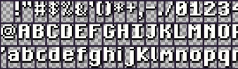

# minigfx

A really minimal single header file graphics library for c

minigfx is a tiny graphics library, providing a unified API for Windows and
Linux. It was inspired by the tigr graphics library, but has been stripped down
on one side but has been extended with other useful things on the other side.

- Bitmap-backed windows
- Direct access to bitmaps, no locking.
- Basic drawing helpers (plot, line, blitter)
- Text output using bitmap fonts
- Mouse, touch and keyboard input
- PNG loading, drawing and saving
- Easy pixel shader access

minigfx is designed to be small and independent. The 'hello world' example is
less than 100kB:

| _Platform_     | _Size_ |
| -------------- | ------ |
| windows x86_64 | 48k    |
| linux x86_64   | 43k    |

There are no additional libraries to include; everything is baked right into
your program.

## How do I program with minigfx?

Here's an example Hello World program. For more information, just read
`minigfx.h` to see the APIs available.

```c
// Define MINIGFX_IMPLEMENTATION before you include minigfx.h
// to also include the implementations.
// Usualy you only need this once in your main.c file, in all
// other files, you only want to include the definitions from the minigfx.h.
// So in those cases dont do: #define MINIGFX_IMPLEMENTATION
#define MINIGFX_IMPLEMENTATION
#include "minigfx.h"

int main(int argc, char *argv[])
{
    MgSurface *screen = mgWindow(320, 240, "Hello", MG_AUTO | MG_2X);
    while (!mgClosed(screen))
    {
        mgClear(screen, mgRGB(0x80, 0x90, 0xa0));
        mgPrint(screen, mgfont, 120, 110, mgRGB(0xff, 0xff, 0xff), "Hello, world.");
        mgUpdate(screen);
    }
    mgFree(screen);
    return 0;
}
```

## How to set up minigfx

minigfx is supplied as a single .h file. To use it, you just drop it right into
your project.

1. Grab minigfx.h
2. Throw it into your project
3. Link with:
   - -lopengl32 and -lgdi32 on Windows
   - -lGLU -lGL -lX11 on Linux

## Custom fonts

minigfx comes with a built-in bitmap font, accessed by the tfont variable.
Custom fonts can be loaded from bitmaps using mgLoadFont. A font bitmap contains
rows of characters separated by same-colored borders. minigfx assumes that the
borders use the same color as the top-left pixel in the bitmap. Each character
is assumed to be drawn in white on a transparent background to make tinting
work.

minigfx font sheets are simply PNG files with rows of white characters on a
transparent background, separated by single-colored borders:



> This is the default font included in minigfx (variable name is `mgfont`), and
> has a black drop shadow.

## Custom pixel shaders

minigfx uses a built-in pixel shader that provides a couple of stock effects as
controlled by mgSetPostFX. These stock effects can be replaced by calling
mgSetPostShader with a custom shader. The custom shader is in the form of a
shader function: void fxShader(out vec4 color, in vec2 uv) and has access to the
four parameters from mgSetPostFX as a uniform vec4 called parameters.

Example:

```c
#include "minigfx.h"
#include "math.h"

const char fxShader[] =
    "void fxShader(out vec4 color, in vec2 uv) {"
    "   vec2 tex_size = vec2(textureSize(image, 0));"
    "   vec4 c = texture(image, (floor(uv * tex_size) + 0.5 * sin(parameters.x)) / tex_size);"
    "   color = c;"
    "}";

int main(int argc, char* argv[]) {
    MgSurface* screen = mgWindow(320, 240, "Shady", 0);
    mgSetPostShader(screen, fxShader, sizeof(fxShader) - 1);

    float duration = 1;
    float phase = 0;
    while (!mgClosed(screen) && !mgKeyDown(screen, TK_ESCAPE)) {
        phase += mgTime();
        while (phase > duration) {
            phase -= duration;
        }
        float p = 6.28 * phase / duration;
        mgSetPostFX(screen, p, 0, 0, 0);
        mgClear(screen, mgRGB(0x80, 0x90, 0xa0));
        mgPrint(screen, tfont, 120, 110, mgRGB(0xff, 0xff, 0xff), "Shady business");
        mgUpdate(screen);
    }
    mgFree(screen);
    return 0;
}
```
